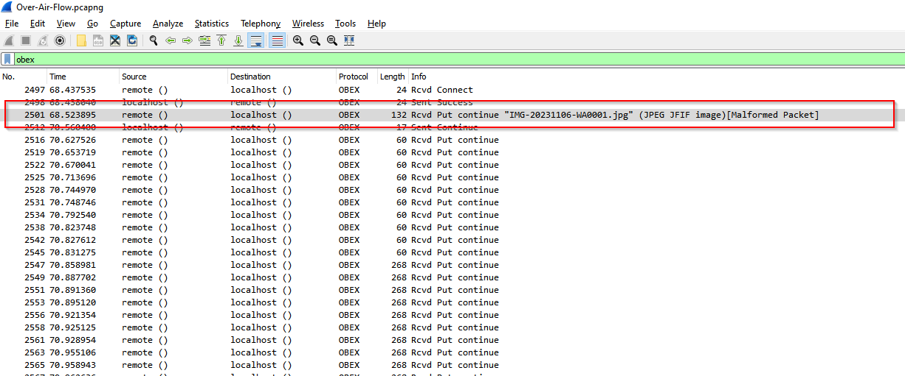
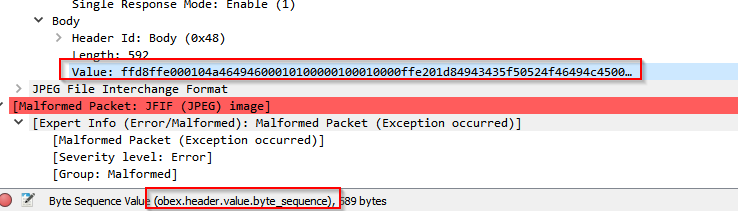
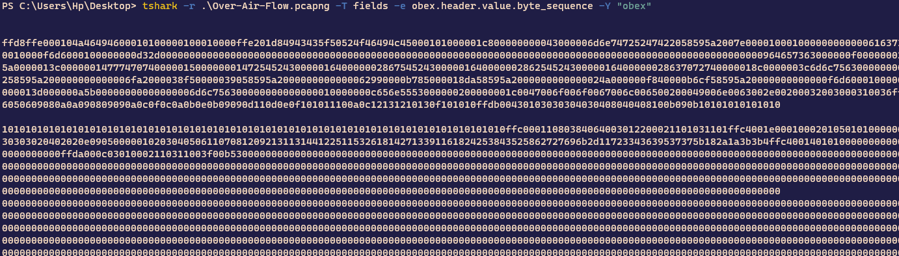
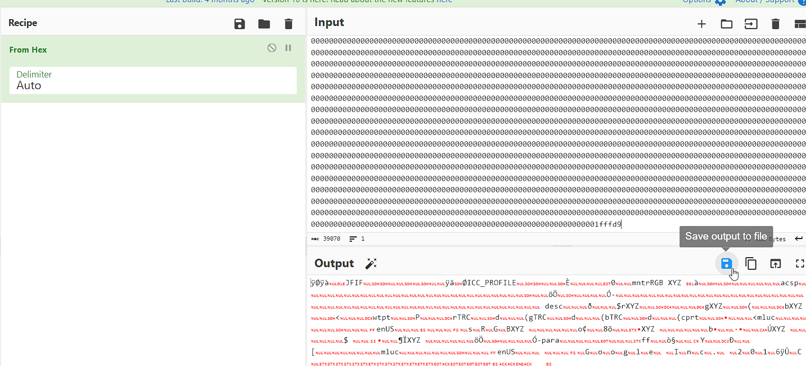
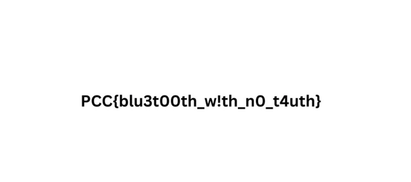

# OverAirFlow

---

## Challenge Description


**Author:** MikiVirus

## Solution


Looking at OBEX protocol which transfers binary data between devices




lets extract the data from the packet


using Tshark we can extract all the binary data 
```bash
tshark -r .\Over-Air-Flow.pcapng -T fields -e obex.header.value.byte_sequence -Y "obex"
```



remove all the new lines and go to [CyberChef](https://gchq.github.io/CyberChef/) and use _From Hex_ and save the output 


FLAG:



---


