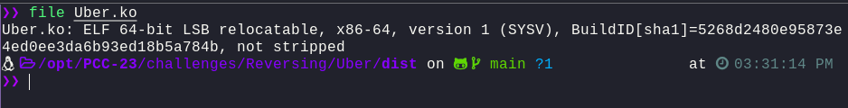
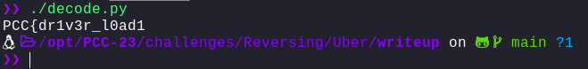
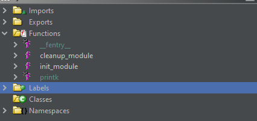
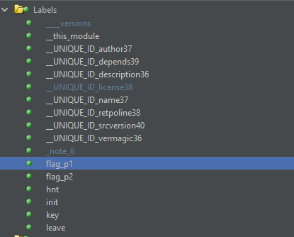
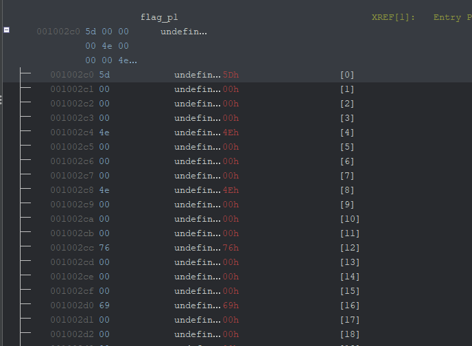
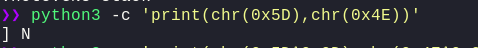
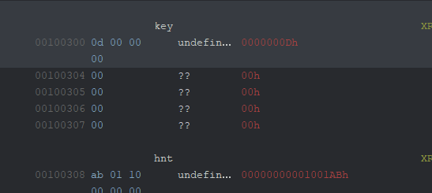
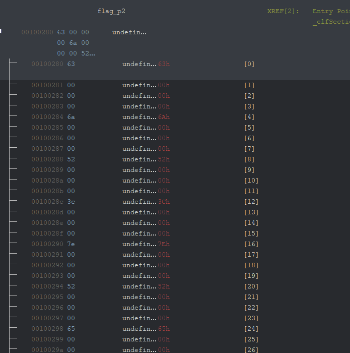
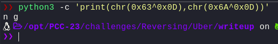
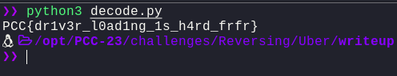

# Uber

---

## Challenge Description

Look Ma, I can DRIVE.

**Author:** TheFlash2k

## Solution

We were provided with an `Uber.ko`. Since it's a reversing challenge, so let's see the output of `file` and `strings` command to check for anything that could be of use



In the `strings` output, we can see a few strings that could be of use, these are

```plaintext
vermagic=5.4.0-163-generic SMP mod_unload modversions
cm94PyBvciB4b3I/Cg==
flag_p1
flag_p2
key
```

The `vermagic` string is the version of the kernel that was used to compile the driver. We can use this to find the kernel version of the machine that compiled the driver. The `flag_p1` and `flag_p2` strings seem to `parts` of the flag.

Let's try and base64 decode teh other string:

```bash
echo cm94PyBvciB4b3I/Cg== | base64 -d
```

Keeping this in the back of our mind, maybe we'll have to 



Let's try and open the `Uber.ko` in Ghidra



In the `export` functions, we see nothing of use. Let's look into labels to try and find the `flag_p1` and `flag_p2`



Well, let's see the value of `flag_p1` and `flag_p2` in the listing window



Well, `flag_p1` seems to have some hex values. Each divided by `3` nullbytes. Let's try and decode `0x5D` and `0x4E` to check what this returns:

```bash
python3 -c 'print(chr(0x5D),chr(0x4E))'
```



Well, the output is weird. But, if we see, we have a `key` variable in the label as well:


The value of key is `0d`. Combining the hint we got before

```plain
rox? or xor?
```

Let's try and xor 0x5d and 0x4e with 0x0d

```bash
python3 -c 'print(chr(0x5D^0x0D),chr(0x4E^0x0D))
```


Well, this gives us `PC` which corresponds with the `PCC` flag format. Let's write a simple `decode.py`

```py
#!/usr/bin/env python3

flag_p1 = [0x5d,0x4e,0x4e,0x76,0x69,0x7f,0x3c,0x7b,0x3e,0x7f,0x52,0x61,0x3d,0x6c,0x69,0x3c]
key = 0x0d

flag = ""

for i in flag_p1:
    flag += chr(i ^ key)

print(flag)
```

Now, running this:


This gives us the `flag_p1`, let's see if `flag_p2` is same or not:



Well, yeah, the flag_p2 looks same as well, let's try and decode the first 2 bytes to verify if the output is same or not:

```bash
python3 -c 'print(chr(0x63^0x0D),chr(0x6A^0x0D))
```



Now, let's extract `flag_p2`, add it to our script and get the flag:

```py
#!/usr/bin/env python3

flag_p1 = [0x5d,0x4e,0x4e,0x76,0x69,0x7f,0x3c,0x7b,0x3e,0x7f,0x52,0x61,0x3d,0x6c,0x69,0x3c]
flag_p2 = [0x63,0x6a,0x52,0x3c,0x7e,0x52,0x65,0x39,0x7f,0x69,0x52,0x6b,0x7f,0x6b,0x7f,0x70]
key = 0x0d

flag = ''.join([chr(i ^ key) for i in flag_p1 + flag_p2])

print(flag)
```

and, after running the script, we get the flag `PCC{dr1v3r_l0ad1ng_1s_h4rd_frfr}`



---